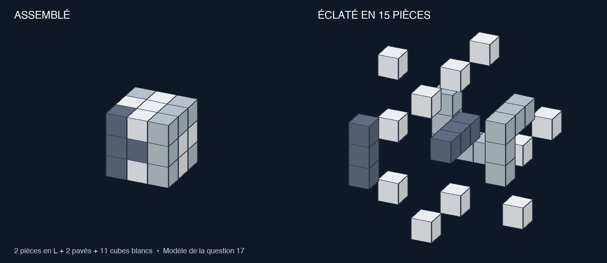

# Simulations and Algorithm Visualizations

This repository contains Python simulations and algorithm visualizations.

The existing simulation runner currently supports two Monte Carlo models:

- **Percolation**: cluster identification and spanning analysis across a range of
  occupation probabilities.
- **Ising**: two-dimensional Ising model with a temperature sweep producing
  lattice snapshots and a magnetization vs. temperature plot.

It also contains starter workspaces for new visual algorithm explorations:

- **Reinforcement Learning**: bandits, gridworlds, value iteration, Q-learning,
  policy gradients, and Monte Carlo control.
- **Probabilistic Robotics**: Bayes filters, Kalman filters, particle filters,
  occupancy grids, localization, and SLAM basics.

## Running simulations

Run `python run.py` to execute the simulation configured in
`config/default.yaml`. Modify this YAML file to change the model or parameters.
Results are saved as PNG images in `data/outputs/` which is ignored by git.

## Repository layout

- `src/` - shared simulation code and existing Monte Carlo models
- `tests/` - automated tests for the existing simulation models
- `config/` - YAML configuration for `run.py`
- `Reinforcement Learning/` - RL visualization notebooks, scripts, and notes
- `Probabilistic Robotics/` - robotics visualization notebooks, scripts, and notes

## The Cat’s Dream

Run `python3 dreaming_cat.py` to watch the thirteen mice puzzle as a desktop
animation. Mouse 8 is white and is eaten last. Use Play/Pause, Next eaten,
Reset, and the speed slider to explore the counting sequence.

Requires Python 3.7+ with Tkinter. Use `--autoplay` to start immediately or
`--sequence` for text output. See [DREAMING_CAT.md](DREAMING_CAT.md) for details.

## Cube assembly in 3D

Run `python3 assemblage-3d/assemblage_3d.py` to explore the cube from
Kangourou 2022, question 17. Rotate the view, animate assembly and disassembly,
or separate all 27 unit cubes. The model contains two L-shaped pieces, two
bars, and eleven white cubes. Hidden parts are a reconstruction consistent
with the three visible faces in the original drawing.

Requires Python 3.9+ with Tkinter; no additional Python packages are needed.
On macOS, the launcher automatically selects an installed Python with Tk 8.6+
when Apple's Tk 8.5 would produce a blank window. It does not change the system
Python or install software.
Run `python3 assemblage-3d/assemblage_3d.py --verifier` to check the geometry.
See [the French user guide](assemblage-3d/LISEZ-MOI.txt) for controls.

